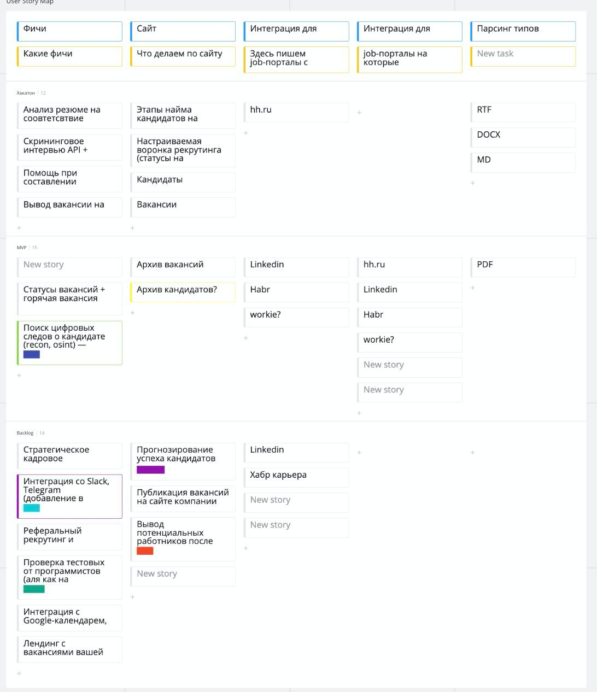

# Сайт для рекрутеров, анализ резюме и скрининг интервью в телеграм боте

## Сайт для рекрутеров
Сайт для рекрутеров располагается в [этом репозитории](https://github.com/awakentrue/EmployeeRecruiting/tree/master).
Написан на .NET core Web API, Blazor, MediatR, MudBlazor, Entity Framework, PostgreSQL, Swagger, RestSharp

## Телеграм бот

В папке [telegram-bot](telegram-bot) находятся исходники telegram бота, который анализирует резюме и проводит скрининг интервью.
Для получения вопросов для скрининга обращается к API сайта для рекрутеров. Написан с помощью [aiogram](https://github.com/aiogram/aiogram) (FSM :fire:).

[Актуальный репозиторий](https://github.com/EZhivaikin/resume-analyzer-telegram-bot)
[Ссылка на бота](https://t.me/gazprom_hr_bot)

## Анализатор резюме
В папке [job-analysis](job-analysis) находится проект с парой jupyter notebook'ов в которых происходил первый анализ вакансий с hh.ru и его переход в поулчение tfidf-значений.
Также там находится API которое принимает на вход файл txt и анализирует его на сходство с вакансиями. Это API в конечном итоге использует [Телеграм бот](telegram-bot), и в целом может исопльзовать любой бот и любое внешнее апи.

[Актуальный репозиторий](https://github.com/EZhivaikin/resume-analyzer-api)

## Сторимапа

